# Сети в Linux
### Задание 1. Инструмент **ipcalc**
### 1.1. Сети и маски
### Определяю и вношу в отчёт:

##### 1) Адрес сети *192.167.38.54/13*

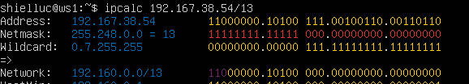

Ответ: 192.160.0.0/13
##### 2) Перевод маски 
**255.255.255.0**:

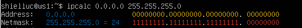

в префиксной записи - /24
в двоичной записи - 11111111.11111111.11111111.00000000

**/15**:

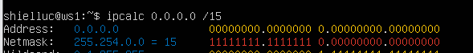

в обычной - 255.254.0.0
в двоичной - 11111111.11111110.00000000.00000000

**11111111.11111111.11111111.11110000**:

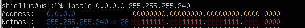

в обычной -  255.255.255.240
в префиксной - /28

##### 3) Минимальный и максимальный хост в сети *12.167.38.4* 
**при маскe */8***:

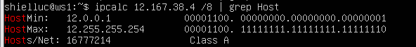

min -12.0.0.1
max -12.255.255.254

**при маске *11111111.11111111.00000000.00000000***:

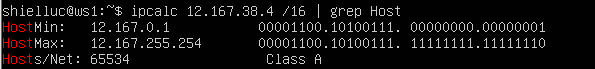

min - 12.167.0.1
max -12.167.255.254

**при маске 255.255.254.0**:

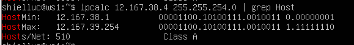

min -12.167.38.1
max -12.167.39.254

**при маске /4**:

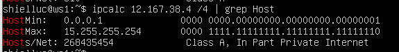

min - 0.0.0.1
max - 15.255.255.254
  
#### 1.2. localhost
##### Определяю и записываю в отчёт, можно ли обратиться к приложению, работающему на localhost, со следующими IP.
К loopback можно обратиться из одной с ним подсети, то есть с адресов, которые начинаются на 127:

Ответ:
*194.34.23.100* - нет
*127.0.0.2* - да
*127.1.0.1* - да
*128.0.0.1* - нет
#### 1.3. Диапазоны и сегменты сетей

##### 1) Какие из перечисленных IP можно использовать в качестве публичного, а какие только в качестве частных: 
> Диапазоны частных IP-адресов, определенные в RFC 1918:
	10.0.0.0 – 10.255.255.255 (префикс /8)
	172.16.0.0 – 172.31.255.255 (префикс /12)
	192.168.0.0 – 192.168.255.255 (префикс /16)

**Публичные:**
*134.43.0.2*, 
*172.68.0.2*,
*172.0.2.1*, 
*192.172.0.1*,  
*192.169.168.1*

**Частные:**
*10.0.0.45*, 
*192.168.4.2*, 
*172.20.250.4*, 
*172.16.255.255*, 
*10.10.10.10* 

##### 2) Какие из перечисленных IP-адресов шлюза возможны у сети *10.10.0.0/18*: 

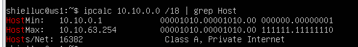

*10.0.0.1* - нет

*10.10.0.2* - да

*10.10.10.10* - да

*10.10.100.1* - нет

*10.10.1.255* - да

## Задание 2. Статическая маршрутизация между двумя машинами

##### С помощью команды `ip a` посмотрою существующие сетевые интерфейсы.

**ip a ws1:**

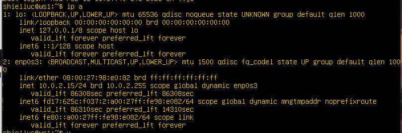

**ip a ws1:**

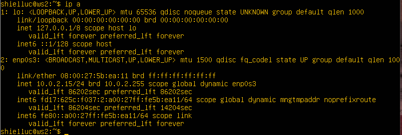

##### Описание сетевого интерфейса, соответствующего внутренней сети.
На обеих машинах и зададим следующие адреса и маски: 
Для этого откроем конфигурационный файл:
*sudo nano /etc!etplan/-installer-config.yaml*

ws1 — *192.168.100.10*, маска */16* :

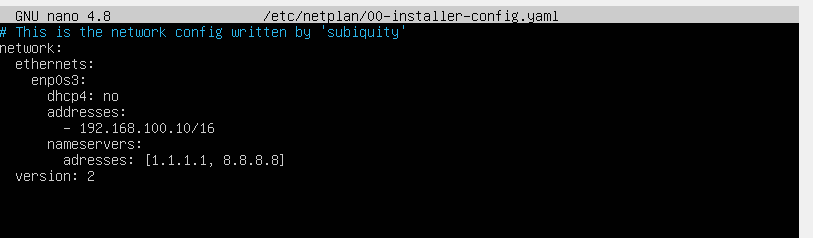

ws2 — *172.24.116.8*, маска */12*:

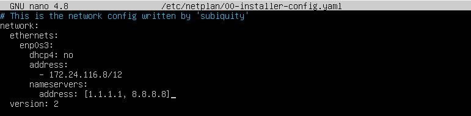

##### Выполняю команду `netplan apply` для перезапуска сервиса сети.

**ws1 - netplan apply:**

**ws2 - netplan apply:**

#### 2.1. Добавление статического маршрута вручную

##### Добавляю статический маршрут от одной машины до другой и обратно при помощи команды вида `ip r add`.

**ws1:** sudo ip route add 172.16.0.0/12

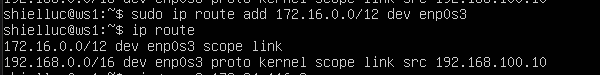

**ws2:** sudo ip route add 192.168.0.0/12

##### PING между машинами:

**ping с ws1 до ws2:**

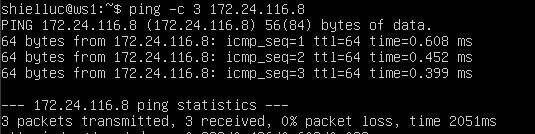

**ping с ws2 до ws1:**
 
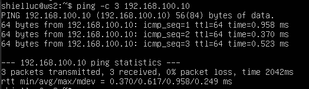

  

#### 2.2. Добавление статического маршрута с сохранением

##### Перезапуск машин командой *reboot*
После перезапуска, добавленные вручную маршруты были сброшены:

**ip route на ws1:**

**ip route на ws2:**

##### Добавляю статический маршрут от одной машины до другой с помощью файла */etc!etplan/00-installer-config.yaml*.

Прописываем путь через указание routes:
1) **На ws1:**

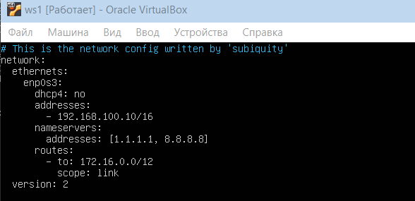

2) **На ws2:**

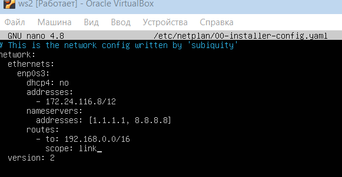

После этого, чтобы изменения вступили в силу, обязательно сохраняю конфигурацию, командой:
*sudo netplan apply*
##### Повторный PING между машинами
**ping с ws1 до ws2:**

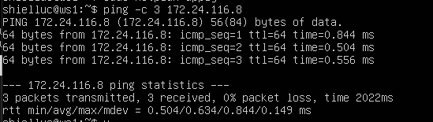

**ping с ws2 до ws1:**

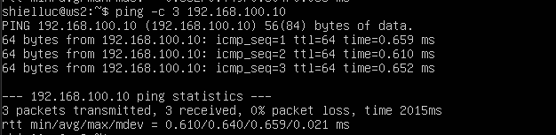

## Задание 3. Утилита **iperf3**
#### 3.1. Скорость соединения
Сначала зафиксируем взаимосвязь
> 1 Byte = 8 bits
> 1 kbit = 1000 bits
> 1 KByte = 1024 Bytes
> 1 mbit = 1000 kbits
> 1 MByte =1024 KBytes
> 1 gbit = 1000 mbites
> 1 GByte = 1024 MBytes
##### Перевод: 
> 1 байт = 8 битов
> Каждый 1 байт состоит из 8 бит
> Значит 8 / 8 = 1 байт
> 8 Mbps (8 мегабит в секунду) = **1 MB/s (1 мегабайт в секунду)**

>1 байт = 8 битов
>100 MB/s (100 мегабайт) × 8 = 800 Mb/s (800 мегабит)
>1 Mb = 1000 Kb (1 мегабит = 1024 килобит)
>800 Mb/s × 1000 = **800000 Kbps (800000 килобайт в секунду)** 

> 1 гигабит в секунду (Gbps) = 1000 мегабит в секунду (Megabits)  
> 1 Gbps = **1000 Mbps( 1000 мегабит)`**

#### 3.2. Утилита **iperf3**
На обеих ВМ установил *iperf3* через *sudo apt install iperf3*

Запустил на ws1 серверную часть, командой iperf -s:

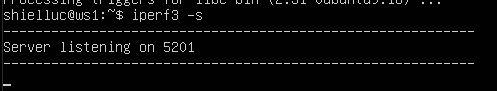

В ответ получил сообщение, что сервер в статусе Listening на стандартном порту 5201.

На ws2 запускаю клиентскую часть данной утилиты, командой:
iperf -c 192.168.100.10 -f K -i 5:

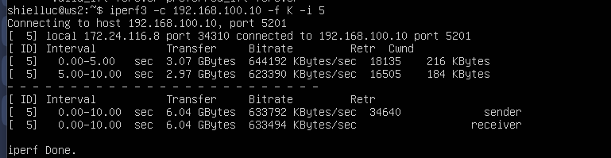

i - интервал между замерами - в данном случае раз в 5 секунд
f - формат, выбрано чтобы выводило в килобайтах

Если на ws1 выйти из режима прослушивания, то с клиента мы уже не сможем воспользоваться данной утилитой и узнать скорость соединения:
ws1:

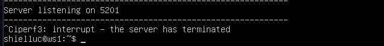

ws2:

## Задание 4. Сетевой экран 
### 4.1. Утилита **iptables**

### Добавление в файл подряд следующих правил:

Cодержание файла /etc/firewall/sh

**на ws1:**

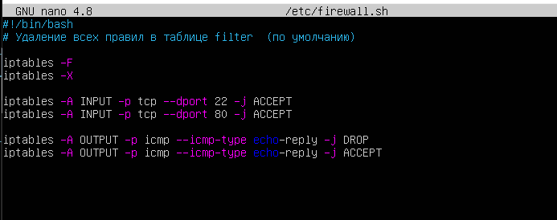

**на ws2:**

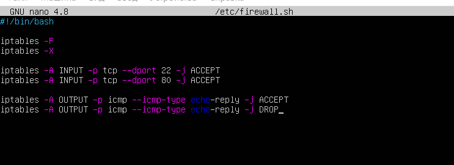

#!/bin/sh — файл будет выполняться как shell-скрипт
iptables -F — удалить все правила из таблицы filter
iptables -X — удалить все пользовательские цепочки
INPUT — входящие соединения
22 — SSH
80 — HTTP (Apache)

**ws1:**
Когда машина пытается ответить на ping:
1. Совпадает первое правило → DROP
2. Пакет выбрасывается
3. До ACCEPT не доходит
 - echo-reply заблокирован
 - машина не пингуется

**ws2:**
Когда система хочет отправить ping-ответ:
1. Совпадает первое правило → ACCEPT
2. Дальше уже не идёт  
 echo-reply разрешён  
 машина пингуется

**Запуск скрипта ws1:**

 

**Запуск скрипта ws2:**

### Разница между стратегиями, применёнными в первом и втором файлах:
> На ws1 правило DROP для echo-reply стоит выше, чем ACCEPT, поэтому пакет отбрасывается, и машина не отвечает на ping.
> На ws2 правило ACCEPT стоит выше, чем DROP, поэтому пакет принимается, и машина отвечает на ping.
> Это показывает, что iptables читает правила сверху вниз, и первое совпадение решает судьбу пакета.
### 4.2. Утилита **nmap**

##### 192.168.100.10 не отвечает на ping

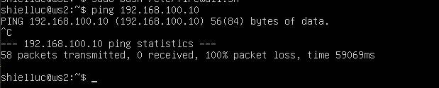

##### nmap 192.168.100.10

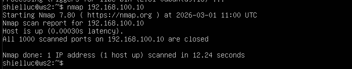

## Задание 5. Статическая маршрутизация сети

  
Сеть:

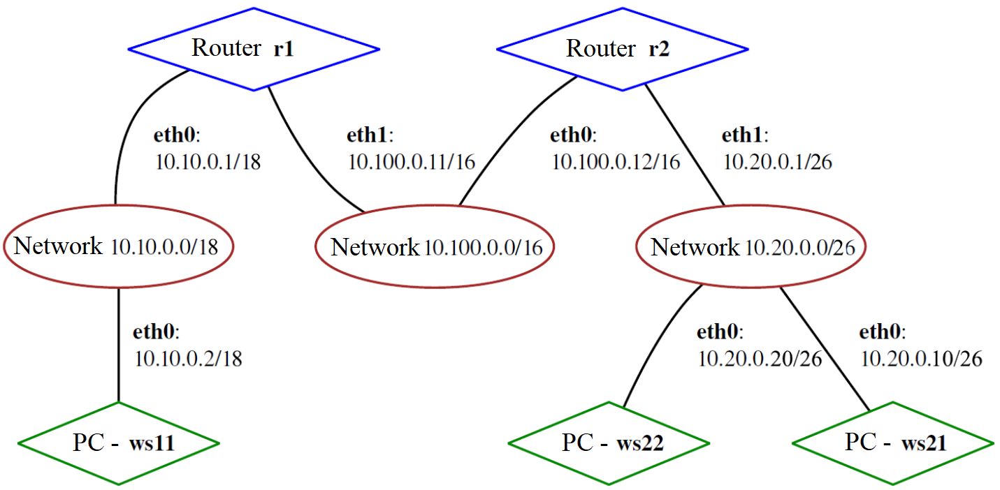

#### 5.1. Настройка адресов машин
Изменяем конфигурационный файл *etc!etplan/00-installer-config.yaml* согласно сети на рисунке:
**ws11 netplan:**

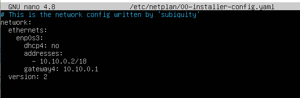

**ws21 netplan:**

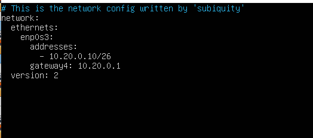

**ws22 netplan:**

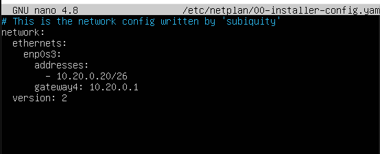

**r1 netplan:**

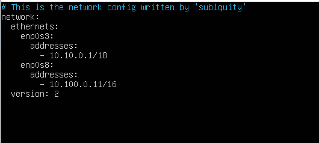

**r2 netplan:**

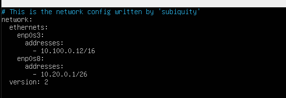

##### Применяю внесенные изменения sudo netplan apply, и проверяем адрес машины командой ip -4 a:

**ws11 sudo netplan apply и ip -4 a:**

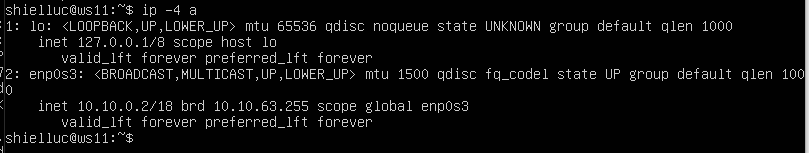

**ws22 sudo netplan apply и ip -4 a:**

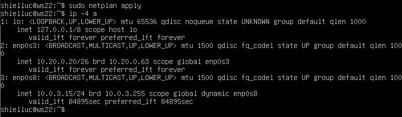

**ws21 sudo netplan apply и ip -4 a:**

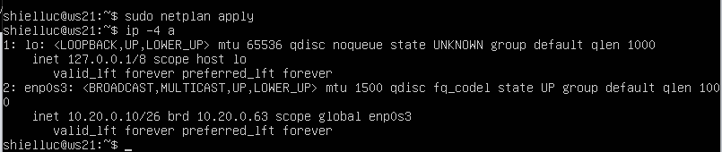

**r1 sudo netplan apply и ip -4 a:**

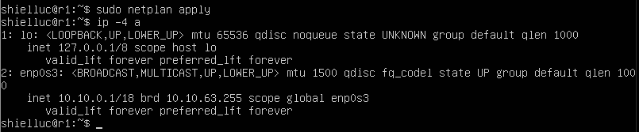

**r2 sudo netplan apply и ip -4 a:**

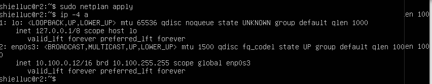

**PING to ws22 from ws21:**

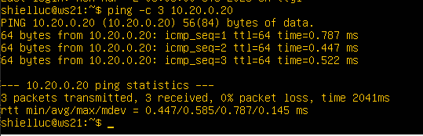

**PING to r1 from ws11:**

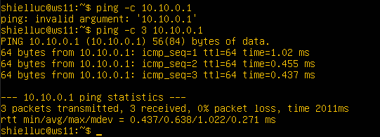

#### 5.2. Включение переадресации IP-адресов

##### Для включения переадресации IP выполняю команду на роутерах:
`sysctl -w net.ipv4.ip_forward=1`

**r1:**

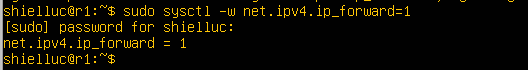

**r2:**

*При таком подходе переадресация не будет работать после перезагрузки системы.*
##### Открываю файл */etc/sysctl.conf* и добавляю в него следующую строку:
`net.ipv4.ip_forward = 1`

**r1:**

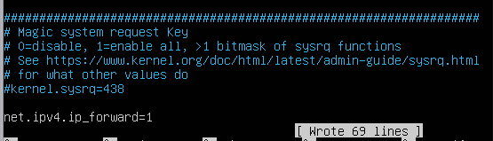

**r2:**

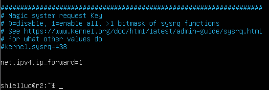

*При использовании этого подхода, IP-переадресация включена на постоянной основе.*

#### 5.3. Установка маршрута по умолчанию

##### Настройка маршрута по умолчанию (шлюза) для рабочих станций. Для этого добавляю `default` перед IP-роутера в файле конфигураций.

Файл *etc!etplan/00-installer-config.yaml*

**ws11 netplan:**

**ws21 netplan:**

**ws22 netplan:**

##### Вызов `ip r`.
**ws11:**

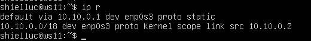

**ws21:**

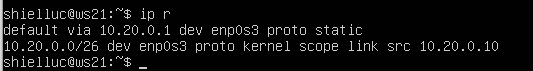

**ws22:**

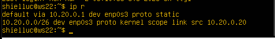

##### PING с ws11 роутер r2, проверка что доходит
**ping from ws11 to r2:**

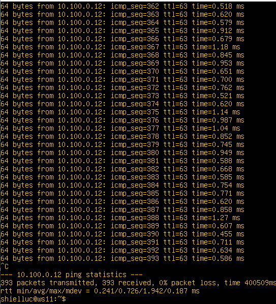

**на r2, что пинг доходит:**
`tcpdump -tn -i eth0`

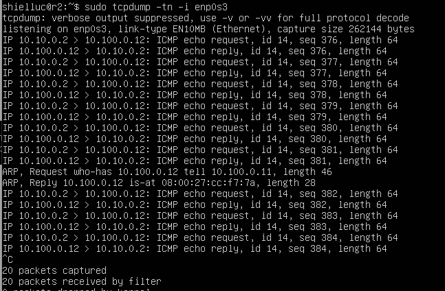

#### 5.4. Добавление статических маршрутов
##### Добавление в роутеры r1 и r2 статические маршруты в файле конфигураций:
**r1 netplan:**

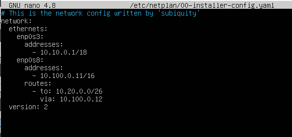

**r2 netplan:**

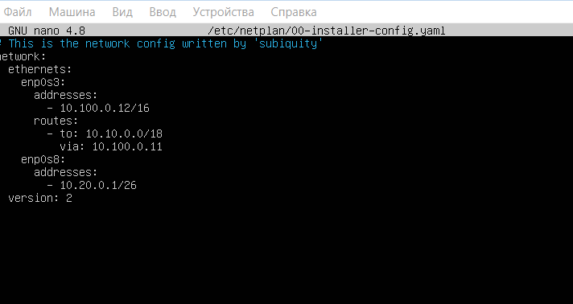

##### Таблицы с маршрутами на обоих роутерах
**r1 - ip r:**

**r2 - ip r:**

##### Запуск команды на ws11:
`ip r list 10.10.0.0/[маска сети]` и `ip r list 0.0.0.0/0`

**Объяснение:**
Адреса из сети 10.10.0.0/18 идут по своему собственному маршруту, так как он задан более конкретно. Маршрут по умолчанию подходит для всего, но если есть более точный вариант, система выбирает его.

#### 5.5. Построение списка маршрутизаторов
##### Запуск на r1 команды дампа:
`tcpdump -tnv -i enp0s3`

##### При помощи утилиты **traceroute** вывожу список маршрутизаторов на пути от ws11 до ws21.

**Объяснение:**
Принцип работы построения пути при помощи traceroute основан на использовании поля TTL (Time To Live) в IP-пакетах. Traceroute отправляет к целевому узлу серию пакетов с постепенным увеличением значения TTL, начиная с 1. Каждый маршрутизатор, через который проходит пакет, уменьшает TTL на 1; когда TTL достигает нуля, маршрутизатор отбрасывает пакет и возвращает отправителю сообщение об ошибке ICMP «time exceeded». Это позволяет traceroute узнать адрес и время отклика каждого промежуточного маршрутизатора на пути к целевому хосту. Процесс продолжается с увеличением TTL, пока пакет не достигнет назначения, который ответит ICMP-сообщением о недостижимости порта (если используются UDP-пакеты) или ICMP Echo Reply (если используются ICMP-запросы), сигнализируя об окончании трассировки.
#### 5.6. Использование протокола **ICMP** при маршрутизации

##### Запуск на r1 перехвата сетевого трафика, проходящего через eth0 с помощью команды:
`tcpdump -n -i eth0 icmp`

##### PING с ws11 несуществующего IP:
`ping -c 1 10.30.0.111`

**r1 - output:**

## Задание 6. Динамическая настройка IP с помощью **DHCP**
Для r2 настраиваю в файле */etc/dhcp/dhcpd.conf* конфигурацию службы **DHCP**:
##### 1) Указал адрес маршрутизатора по умолчанию, DNS-сервер и адрес внутренней сети:

##### 2) В файле *resolv.conf* прописал `nameserver 8.8.8.8`.

##### Перезагрузил службу **DHCP** командой `systemctl restart isc-dhcp-server`. 

Машину ws21 перезагружаю при помощи `reboot` и через `ip a` вывожу ip:

**PING to ws22 from ws21:**

##### У ws11 указываю MAC-адрес
Для этого в *etc!etplan/00-installer-config.yaml* надо добавить строки: `macaddress: 10:10:10:10:10:BA`, `dhcp4: true`.

##### Для r1 настраиваю аналогично r2, но с жесткой привязкой к MAC-адресу (ws11):

Перезагрузил службу **DHCP** командой `systemctl restart isc-dhcp-server`:

**ws11 - ip a:**

##### Запросил с ws21 обновление IP-адреса:
ws21 - ip a - до обновления:

ws21 - ip a - после обновления:

В текущем задании использовались следующие опции DHCP-сервера: 
**range** -  для задания диапазона выдаваемых IP-адресов, 
**option routers**  - для передачи клиентам адреса шлюза по умолчанию, 
**option domain-name-servers** - для передачи адреса DNS-сервера. 

Для реализации жёсткой привязки IP-адреса к виртуальной машине ws11 применялись опции **hardware ethernet** и **fixed-address**, позволяющие назначать определённый IP-адрес клиенту с заданным MAC-адресом. 

При обновлении IP-адреса на ws21 использовался стандартный механизм аренды DHCP, при котором клиент и сервер обмениваются сообщениями 
DISCOVER, 
OFFER, 
REQUEST
ACK

## Задание 7. **NAT**
##### В файле */etc/apache2/ports.conf* на ws22 и r1 изменил строку `Listen 80` на `Listen 0.0.0.0:80`, то есть сделал сервер Apache2 общедоступным:

**ws22 - */etc/apache2/ports.conf*:**

**r1 - */etc/apache2/ports.conf*:** 

##### Запустил веб-сервер Apache командой `service apache2 start` на ws22 и r1.
ws22:

r1:

##### Добавил в фаервол, созданный по аналогии с фаерволом из Части 4, на r2 следующие правила:

1) Удаление правил в таблице filter — `iptables -F`;
2) Удаление правил в таблице «NAT» — `iptables -F -t nat`;
3) Отбрасывать все маршрутизируемые пакеты — `iptables --policy FORWARD DROP`.
Содержимое firewall.sh r2:

##### Запустил файл также, как в Части 4.

##### Проверяю соединение между ws22 и r1 командой `ping`.
*При запуске файла с этими правилами, ws22 не пингуется с r1.*:

##### 4) Разрешаю маршрутизацию всех пакетов протокола **ICMP**.

##### Проверяю соединение между ws22 и r1 командой `ping`.
*При запуске файла с этими правилами, ws22 должна «пинговаться» с r1:

##### Добавляю в файл ещё два правила:
**SNAT** (Source Network Address Translation) и DNAT (Destination Network Address Translation) - это два типа трансляции IP-адресов, используемых для изменения адресов источника и назначения в IP-пакетах при прохождении через маршрутизатор.

**SNAT** используется для изменения IP-адреса источника, когда пакет покидает локальную сеть и направляется во внешнюю сеть. Это позволяет скрыть реальный IP-адрес отправителя и использовать общедоступный IP-адрес маршрутизатора в качестве источника пакета.

**DNAT** используется для изменения IP-адреса назначения, когда пакет приходит во входящий интерфейс маршрутизатора. Это позволяет перенаправить трафик на другой IP-адрес в локальной сети, скрыть реальный IP-адрес получателя или разрешить доступ к локальным ресурсам из внешней сети.
##### 5) Включаю **SNAT**, а именно маскирование всех локальных IP из локальной сети, находящейся за r2.
##### 6) Включаю **DNAT** на 8080 порт машины r2 и добавляю к веб-серверу Apache, запущенному на ws22, доступ извне сети.

##### Запустил файл

##### Проверяю соединение по TCP для **SNAT**: для этого с ws22 подключиться к серверу Apache на r1 командой:
`telnet [адрес] [порт]`:

##### Проверяю соединение по TCP для **DNAT**: для этого с r1 подключиться к серверу Apache на ws22 командой `telnet`:

## Задание 8. Дополнительно. Знакомство с **SSH Tunnels**
##### Запускаю на r2 фаервол с правилами из Части 7.
Для возможности подключаться к ws22 по ssh, на r2 добавлены новые правила в firewall.sh, а именно:

Строка:
`iptables -A FORWARD -p tcp -d 10.20.0.20 --dport 22 -j ACCEPT`

**Что делает:**
Разрешает НОВЫЕ SSH-подключения к ws22.  
  
**-A FORWARD** — правило для маршрутизируемых пакетов (через r2)  
**-p tcp** — только TCP  
**-d 10.20.0.20** — назначение = ws22  
**--dport 22** — порт SSH  
**-j ACCEPT** — разрешить  

Без этой строки ssh соединение с ws22 с другой машины не установится вообще

Вторая строка:
`iptables -A FORWARD -p tcp -s 10.20.0.20 --sport 22 -m state --state ESTABLISHED,RELATED -j ACCEPT`  

**Что делает:**
Разрешает ОТВЕТЫ от ws22 по SSH.  

**-s 10.20.0.20** — источник = ws22  
**--sport 22** — ответ идёт с SSH-порта  
**-m state** — используем модуль состояния  
**--state ESTABLISHED,RELATED** — это уже установленное соединение  
**-j ACCEPT** — разрешить  

Без этой строки SSH-сессия зависнет после подключения.  
Клиент отправит SYN → сервер ответит → ответ будет отброшен.
##### Запускаю веб-сервер **Apache** на ws22 только на localhost 
в файле */etc/apache2/ports.conf* изменяю строку `Listen 80` на `Listen localhost:80`

sudo service apache2 restart:

##### *Local TCP forwarding* с ws21 до ws22, чтобы получить доступ к веб-серверу на ws22 с ws21.
Local TCP forwarding был использован для организации доступа к веб-серверу Apache, работающему на ws22 и доступному только на localhost, с машины ws21.

**ssh -L 9999:localhost:80 shielluc@10.20.0.20:**

Проверка подключения: 

##### *Remote TCP forwarding* c ws11 до ws22, чтобы получить доступ к веб-серверу на ws22 с ws11.

Проверка подключения: 

